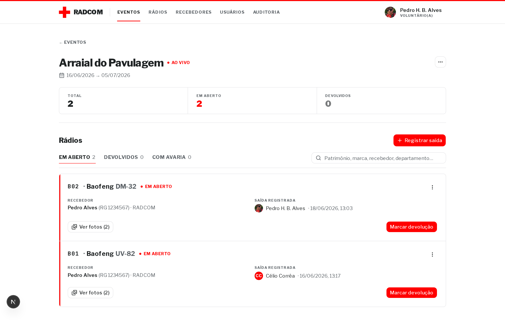
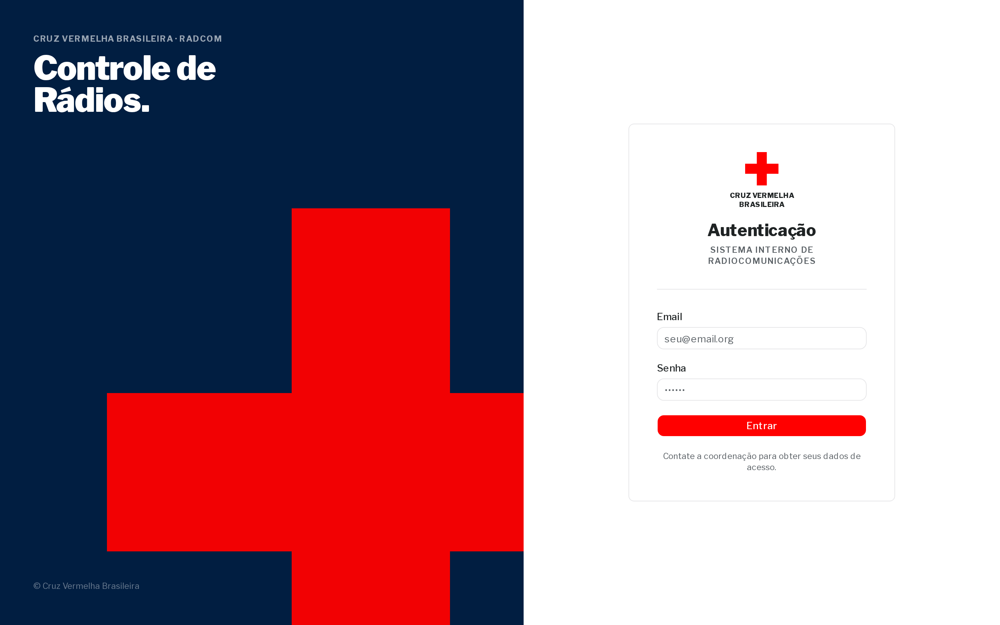
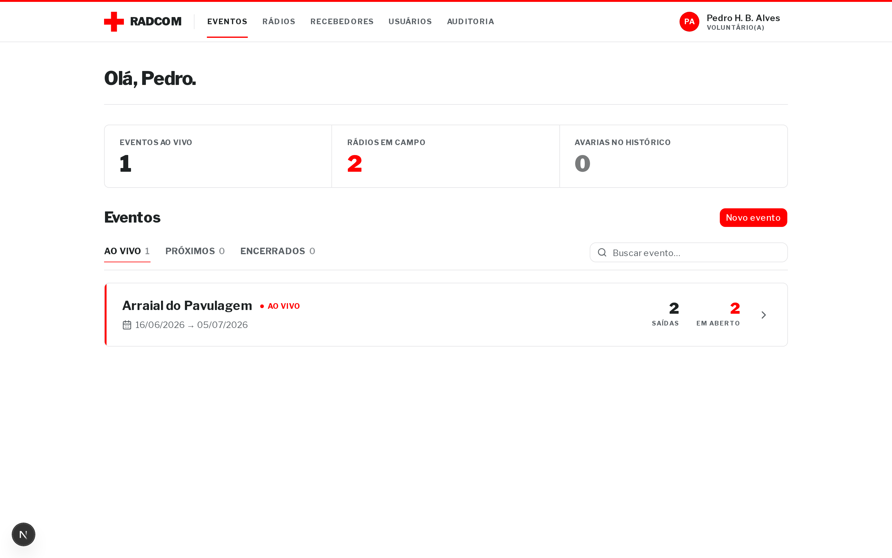

<div align="center">

  

# RADCOM

### Controle de empréstimo e devolução de rádios em eventos da Cruz Vermelha Brasileira

[](https://www.cvb.org.br/)
[](https://web.dev/progressive-web-apps/)
[](#)
[](#)

[](https://nextjs.org/)
[](https://www.typescriptlang.org/)
[](https://react.dev/)
[](https://www.prisma.io/)
[](https://www.postgresql.org/)
[](https://supabase.com/)
[](https://authjs.dev/)
[](https://tailwindcss.com/)
[](https://ui.shadcn.com/)

<br />



</div>

---

## Sobre

**RADCOM** é o sistema interno de radiocomunicações da Cruz Vermelha
Brasileira Paraense para controlar o empréstimo (saída) e a devolução de rádios
alugados ou do acervo patrimonial da CVBPA durante eventos: Círio, arraiais, mutirões, operações de campo.

É um fluxo de _check-out_ / _check-in_ de equipamento, com prova fotográfica
(RG do recebedor + rádio na entrega) e rastreabilidade de quem ficou
responsável e do estado em que o rádio voltou.

## Funcionalidades

- **Eventos** — criar, editar e acompanhar eventos com `dataInicio` / `dataFim`.
  Status calculado automaticamente: ao vivo, próximo, encerrado.
- **Cadastro reutilizável** — `Rádio` (patrimônio) e `Recebedor` (pessoa em
  campo) são entidades reutilizadas entre eventos.
- **Saída de rádio** — vincula rádio ↔ recebedor ↔ evento. Captura foto do RG
  e do rádio na entrega como prova do ato.
- **Devolução** — tabela separada com relação 1:1. Registra quem devolveu
  (pode ser outra pessoa), avaria, observação e foto.
- **Auditoria imutável** — toda ação sensível vira `AuditLog` que sobrevive
  à deleção do ator (snapshot do nome + FK SetNull).
- **PWA instalável** — manifest, ícones (incl. maskable), splash automático
  via theme color. Roda em tela cheia no celular.
- **Storage privado** — fotos no Storage com URLs assinadas de curta
  expiração (RG e fotos pessoais nunca ficam públicos).
- **Crachá funcional** — geração de crachá com foto e papel pra identificação
  em campo.

## Galeria

<table>
  <tr>
    <td width="50%" align="center">
      
      <p><sub>Login institucional</sub></p>
    </td>
    <td width="50%" align="center">
      
      <p><sub>Dashboard com KPIs e eventos</sub></p>
    </td>
  </tr>
</table>

## Stack

| Camada            | Tecnologia                                          |
| ----------------- | --------------------------------------------------- |
| Framework         | Next.js 16 (App Router, Turbopack, RSC)             |
| Linguagem         | TypeScript                                          |
| ORM               | Prisma 7 (provider `prisma-client`)                 |
| Banco             | PostgreSQL via **Supabase**                         |
| Storage           | Supabase Storage (bucket privado, URLs assinadas)   |
| Auth              | **Auth.js v5** (credentials + roles)                |
| UI                | Tailwind CSS v4 + shadcn/ui (Base UI)               |
| Formulários       | React Hook Form + Zod                               |
| Identidade visual | Manual da Cruz Vermelha Brasileira (Libre Franklin) |

## Domínio em uma página

```
Evento ┐
       │ (1:N)
Radio ─┼─→ Registro ──(1:1)──→ Devolucao
       │       │
Recebedor ←────┘
       │
User (criadoPor — auditoria do operador logado)
```

- **Saída/empréstimo = `Registro`.** Liga `Evento × Radio × Recebedor` e
  guarda as provas do ato (`urlFotoRg`, `urlFotoRadioSaida`).
- **Devolução é tabela separada com 1:1**. "Está devolvido?" = a `Devolucao`
  existe. Não há campo de status no `Registro`.

## Identidade visual

Padrão visual segue o **Manual de Identidade Institucional da Cruz Vermelha
Brasileira**: paleta vermelho `#FF0000` + navy `#011E41` + dark `#1f2324` +
cinza `#A7AFB2`, tipografia da família **Franklin Gothic** (Libre Franklin
no Google Fonts), composição sóbria e institucional — não SaaS com cara
de IA.

- **Hairlines** no lugar de sombras
- **Faixa CV 3px vermelha** no topo do shell como assinatura visual
- **Status sem pílulas coloridas**: dot vermelho + `uppercase tracking-wide`
- **Touch generoso**: áreas usadas em campo (`size="lg"` em ações primárias)
- **Mono pra dados técnicos**: JetBrains Mono + `tabular-nums`

## LGPD

O sistema armazena documento de identificação (foto do RG) e fotos pessoais
no Supabase Storage privado, com URLs assinadas de curta expiração. A
política de retenção deve ser definida com a coordenação.

---

<div align="center">
  <sub>Feito para a equipe de radiocomunicação da <strong>Cruz Vermelha Brasileira Paraense</strong>.</sub>
</div>
